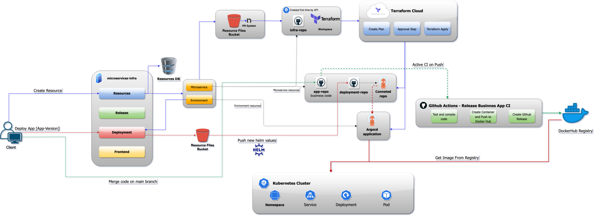
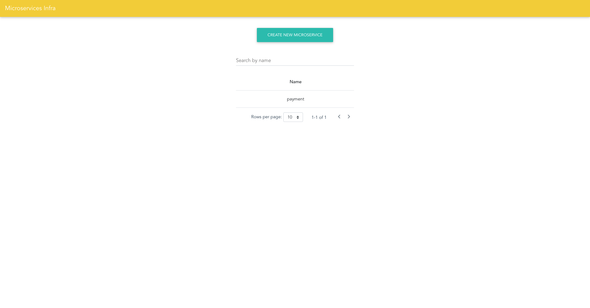

# Microserviceses Infrastructure Builder and Manager
## Documentation
### Goals
The goal of this microservice is that you can, **with one click**, create, update, or destroy any infrastructure resource, through a web client. Also, you can deploy your app, see the status, and access to useful resources and links, all by a beautiful web client.

Also, another goal, is that in the repository for the developer where develop new code day by day, it will be only business code, nothing related to deployment nor infrastructure, only business code.
### Principles and Practices
The code behind this service is developed to be compliance with the DevOps Principles and Practices:
- Immutable Infrastructure
- Infrastructure as Code
- Continuous Integration and Continuous Delivery

Also, it follows the GitOps philosophy, where the status of a specific system (an infrastructure resource, or a deployed artifact), is reflected by the last commit of a git repository.
### High Level Architecture

### Creation flow
#### Creating microservice
When you call this app to create a new microservice, it is going to create the following things:
- The GitHub repository for all the infrastructure code
- A new workspace in Terraform Cloud to manage the other repositories (and initialize all needed variables)
- A deployment GitHub repository, where it would contain the code for deploy new versions of new microservices
- A business GitHub repository, where it would contains all the business code of the new microservice.
- Lastly, it will create a connection between the deployment repository and the ArgoCD server.

So, basically, the GitHub repository for infra code, and the Terraform Cloud workspace, will be created via API, because, for the first time, we need a way to start creating things from code, so, it is like the 'chicken and egg' paradigm, so, for start executing infra as code, we need the workspace where it applies the infra code.
Then, when we have already created the GitHub repository for infrastructure code, and the Terraform Cloud workspace, it is going to create a PR to the infra repository, adding all the rest of elements from the above list, as code, where Terraform Cloud CI will check it, and if it is ok, then the service automatically will merge it, so then Terraform Cloud will apply this changes.

To create a microservice, you have to register your Kubernetes Cluster where the microservice will be created first.
#### Creating environment
When you call this app to create a new environment for a specific microservice, it is going to do the following things:
- Create a new Terraform Cloud workspace (every resource has it own workspace)
- Then create a new PR with the code to add:
  - New ArgoCD app, will be in charge to manage all kubernetes system.
    
ArgoCD app will be creating all things needing from the deployment repo, so it would contain the Helm template for creating all things that a microservice need from Kubernetes.
### Technologies used
#### Kubernetes
It is uses Kubernetes for creating all processing requirements for the microservice
#### GitHub
It is use GitHub to persist code from:
- Infrastructure
- Deployment
- Business

So, every microservice will contain those 3 repositories.
#### GitHub Actions
To perform the creation of new images and test the code on PRs or Push, it is uses a GitHub actions template to perform the CI/CD related things.
#### Terraform Cloud
In order to automatically persist the states files from terraform, and also take advantage of the CI checks in PRs for infrastructure code, we use Terraform Cloud.
#### DockerHub
DockerHub will be where you persist the microservices Docker images, so then you can pull it from Kubernetes to deploy your apps.
You can use whatever registry server that you want, make sure that specify the correct path to the image so Kubernetes can pull it in a correct way.
#### ArgoCD
ArgoCD was created naturally for Kubernetes, so, it will sync the microservice state with the deployment repo, and perform every change you need automatically.
#### MySQL
MySQL is used to persist information about every resource that is created
#### MinIO
Locally, we are using MinIO as a Document Storage service. So, it will contain all the templates of Helm for create microservices, and also all the templates from Terraform for create new infrastructure.
#### Istio
Istio is a service mesh for Kubernetes created by Google
## Configuration
This is a one time configuration. Once you configured all the services that the app interacts with, then you will have the app ready to start to create and manage as many microservices as you want.

Also, an example of the configuration file for run this microservice, is included in the [appendix](#Example-configuration-file).

For run it locally, you have to provide a configuration file like the example mentioned above, in the path:
`application/spring/src/main/resources/application-dev.yml`
### Configuring GitHub
In order to allow the app to manage and create GitHub repositories, PRs, etc. You have to config the following environment variables:
```
github:
  owner: Owner of the account, where it would be created all the repos
  token: A GitHub token to allow to manage the repos, delete them, commit, create PRs, push commits, etc. 
```
[How to create a GitHub Token](https://docs.github.com/en/github/authenticating-to-github/creating-a-personal-access-token)
### Configuring Terraform Cloud
In order to allow the app to create and persist state of all infrastructure, we need to configure the following things:
```
terraform:
  user: user owner of the account
  token: API token to allow the app to perform actions
  org: the organization where workspaces will be created
  vsc-token: Token to allow Terraform Cloud to connect to you GitHub repositories.
```
[How to create a Terraform Cloud API Token](https://www.terraform.io/docs/cloud/users-teams-organizations/api-tokens.html)

[How to create a Terraform Cloud Organization](https://www.terraform.io/docs/cloud/users-teams-organizations/organizations.html)

[How to create a Terraform Cloud VSC Token](https://www.terraform.io/docs/cloud/vcs/github.html)
### Configuring DockerHub
For configuring DockerHub, where it will basically upload Docker images, you will need to configure the following things:
```
docker-registry:
  user: user of the account
  repo: repo where it will push the images
  token: pass of the account
```
[How to create a DockerHub repository](https://docs.docker.com/docker-hub/repos/)

Also, I recommed to create a template for the business app where it will contain the GitHub Action files to test and push the Docker image to DockerHub repository.
You can find the code of the actions in the documentation folder.
### Configuring Bucket (Minio for local development)
When you run the app with docker-compose, it will runs a bucket service like S3, called MinIO. So, go inside [MinIO](http://localhost:9000), then, use the default user and pass to log in:
```
user: minio
pass: minio123
```

Once you logged in, create 2 buckets:
- deployment
- infrastructure

Inside the `deployment` bucket, copy the folder called `templates` from `application/spring/src/main/resources/helm/environment` and paste it into the bucket

Inside the `infrustructe` bucket, copy the folders from `application/spring/src/main/resources/terraform` and paste it into the bucket
### Providing a Kubernetes Cluster
You will need at least one Kubernetes cluster to:
- Create the ArgoCD server 
- Create the Istio config
- Create microservices stuff

Of course that you can have as many clusters as you can. So, remember to register them in this app, so then the app allows you to create a microservice in that cluster.

So, for now, it has to be a cluster in a cloud provider, why? Because you have to allow Terraform Cloud to connect to the cluster to config things on argocd, and to allow argocd to connect to the cluster to create microservices related things.
If you want to use a local cluster on your machine, then you have to expose an IP address so the services that we mentioned recently can access to it.
### Configuring ArgoCD
Once you have the cluster, then, you can follow [these steps (step 1 to 4)](https://argoproj.github.io/argo-cd/getting_started/) to configure ArgoCD in the cluster.

If you are going to use a different cluster where ArgoCD lives to create your microservice, then you have to register your cluster in ArgoCD (step 5 of the previous link).

Finally, fill the environment variables with the ArgoCD server data:
```
argocd:
  host: host of the argo cd server, you have to expose it
  port: port of the argo cd server
  user: username
  pass: password # kubectl get pods -n argocd -l app.kubernetes.io/name=argocd-server -o name | cut -d'/' -f 2
  namespace: "argocd"
```
### Configuring Istio
For install Istio in one of the clusters, just execute the scripts located in `documentation/istio_scripts`
You have to execute the scripts in the following order:
```
$ ./1_download_istio.sh -v 1.9.0 -d

$ ./2_install_instio_on_k8s_cluster.sh

$ /3_install_istio_integrations_on_k8s_cluster.sh -v 1.9.0
```
Every script will take of every step to install and configure istio. You can execute --help of every script to see the arguments that it accepts.

After executing the scripts, you have to add a gateway in order to let Istio allow public traffic to your cluster:
```yaml
apiVersion: networking.istio.io/v1alpha3
kind: Gateway
metadata:
  name: public-gateway
spec:
  selector:
    istio: ingressgateway # use istio default controller
  servers:
  - port:
      number: 80
      name: http
      protocol: HTTP
    hosts:
    - "*"
```
## Running
Once you have the configuration done, and you provided all the environment variables required, then, you have a makefile to start the app.
```
$ make build
$ make start
```

### Registering a cluster
You have to register you cluster so then the microservice will know where should live.
```
curl --location --request POST 'http://localhost:8081/cluster' \
--header 'Content-Type: application/json' \
--data-raw '{
    "name": "{cluster-name}",
    "host": "https://{cluster-ip}",
    "createdBy": "${person-name-registering-it}"
}'
```
### Accessing to Frontend to manage all resources
Go to `http://localhost:8081` or the domain where you are running your application, and you will see a screen like this:



**Then, you are ready to start to use it! 😃🚀**

## Appendix
### Example configuration file
```yaml
# port
server.port: 8081

# Logging
logging.level.com.infra: DEBUG

# MySql Local Connection
microservicesdb:
  host: "localhost"
  port: 3306
  db: "microservices"
  user: "hm"
  pass: '123456'
  url: "jdbc:mysql://${microservicesdb.host}:${microservicesdb.port}/${microservicesdb.db}"

spring.datasource.url: ${microservicesdb.url}
spring.datasource.username: ${microservicesdb.user}
spring.datasource.password: ${microservicesdb.pass}

spring.jpa.database: mysql
spring.jpa.hibernate.ddl-auto: update

document-storage:
  host: "localhost"
  port: "9000"
  user: "minio"
  pass: "minio123"
  url: "http://${document-storage.host}:${document-storage.port}"
  deployment-bucket: "deployment"
  infra-bucket: "infrastructure"

github:
  owner: "user" # github user
  token: "fdjssiad" # github token

docker-registry:
  user: "user" # dockerhub user
  repo: "repo-for-test" # dockerhub repository to upload container images
  token: "password" # dockerhub pass

argocd:
  host: "34.123.86.257" # argocd host
  port: "80" # argocd port
  user: "admin" # argocd user
  pass: "admin" # argocd pass
  namespace: "argocd" # argocd namespace

terraform:
  user: "user" # terraform user
  token: "fdansfa" # terraform token
  org: "organization" # terraform org
  vsc-token: "dfasnjfd" # terraform vsc token
```